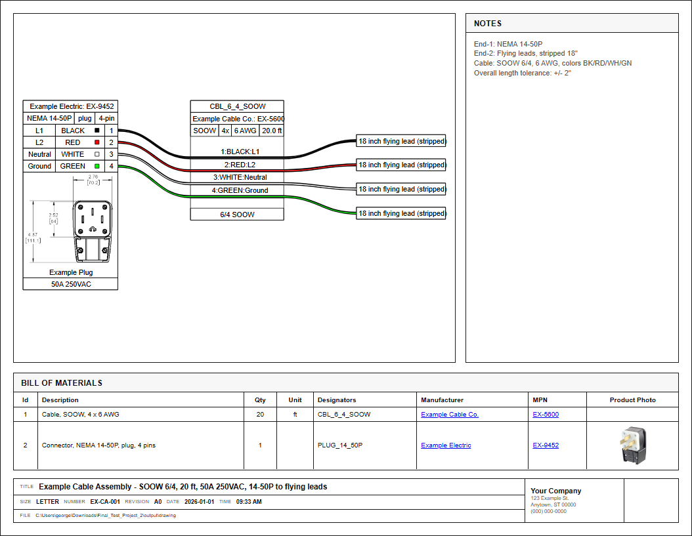

# WireVizHelper

WireVizHelper extends [WireViz](https://github.com/wireviz/WireViz) to produce engineering-style drawing sheets, a richer engineering template output, and improved BOM handling while keeping YAML as the source of truth.

You still use standard WireViz YAML features, syntax, and commands for your drawings. WireVizHelper wraps on top of that workflow with engineering-focused output and packaging convenience.
Thanks to the WireViz maintainers and contributors for building such a useful foundation.

The primary goal is reliable Python-based drawing generation across platforms. The Windows app (`WireVizHelper.exe`) is a convenience option for users who do not want to install Python dependencies manually.

## Engineering Template Highlights



- **Engineering Sheet Output**: Generates a print-ready HTML/PDF with title block, notes panel, and branding.
- **BOM Photo Integration**: Merges photo helper rows into matching BOM part rows (`SPN` becomes `Product Photo`).
- **Automated PDF Generation**: Uses your local Chromium-based browser (headless) to export PDFs.
- **Project Scaffolding**: Quickly creates new project folders with starter YAML and templates.

For configuration details, see [`docs/yaml-options.md`](docs/yaml-options.md).

## Running from Source (macOS/Linux/Windows)

1. Clone this repository.
2. Install Python dependencies.
3. Install Graphviz on your system.
4. Scaffold and build your project.

```bash
git clone https://github.com/GeorgeIoak/WireVizHelper
cd WireVizHelper
python -m pip install -r requirements.txt
```

Graphviz install examples:

```powershell
# Windows (PowerShell)
winget install Graphviz.Graphviz
```

```bash
# macOS
brew install graphviz
```

```bash
# Ubuntu / Debian
sudo apt-get update
sudo apt-get install -y graphviz
```

Verify Graphviz:

```bash
dot -V
```

Build a project:

```bash
python scaffold.py --name "My Cable Drawing" --dest ~/Design
cd ~/Design/My_Cable_Drawing
python /path/to/WireVizHelper/build.py drawing.yaml
```

Windows PowerShell example:

```powershell
python scaffold.py --name "My Cable Drawing" --dest "C:\Users\me\Documents\Design"
cd "C:\Users\me\Documents\Design\My_Cable_Drawing"
python "C:\path\to\WireVizHelper\build.py" drawing.yaml
```

## Windows App (No Python Setup)

1. Download `WireVizHelper.zip` from GitHub Releases.
   Advanced: CI artifacts from GitHub Actions are available for development/testing.
2. Extract to a normal local folder (example: `C:\Tools\WireVizHelper`).
3. Run `WireVizHelper.exe`.

Important:

- Keep `WireVizHelper.exe` and the `_internal` folder together after extraction.
- If `_internal` is moved or missing, the app will fail to start.

## Basic Use

In the app:

1. Use `Create New Project` to scaffold starter files.
2. Edit your YAML.
3. Use `Build Existing Project` to generate HTML/PDF engineering-sheet outputs plus standard WireViz diagram exports (SVG/PNG/TSV).

## CLI Use (Packaged EXE)

```powershell
.\WireVizHelper.exe --version
.\WireVizHelper.exe build .\my-project\drawing.yaml
.\WireVizHelper.exe scaffold --name "Panel Harness A" --dest C:\Work\Drawings
```

## Roadmap / TODO

- Add optional engineering-sheet PNG output (`drawing.sheet.png`) generated from the final PDF for deterministic results.
- Investigate engineering-sheet SVG output feasibility (current `drawing.svg` is the native WireViz diagram export, not the full sheet).
- Explore DXF export options for CAD-oriented workflows.

Implementation notes:

- Preferred near-term path for PNG: convert the already-validated final PDF to PNG, rather than browser screenshot capture.
- Keep existing native WireViz outputs (`drawing.svg`, `drawing.png`) unchanged for compatibility.
- If DXF is added, ship it as an additional export (`drawing.sheet.dxf`) without changing current outputs.

## Documentation Map

- Developer packaging and CI notes: [`docs/developer-packaging.md`](docs/developer-packaging.md)
- YAML fields and metadata: [`docs/yaml-options.md`](docs/yaml-options.md)
- Troubleshooting guide: [`docs/troubleshooting.md`](docs/troubleshooting.md)
- Starter YAML example: [`examples/minimal_drawing.yaml`](examples/minimal_drawing.yaml)
